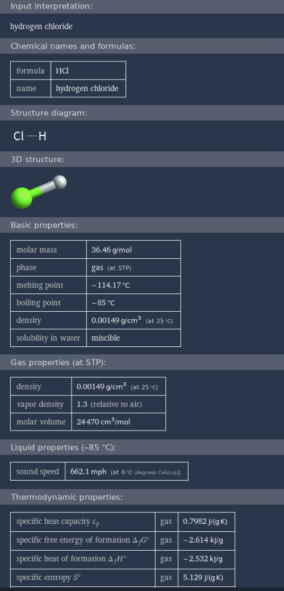
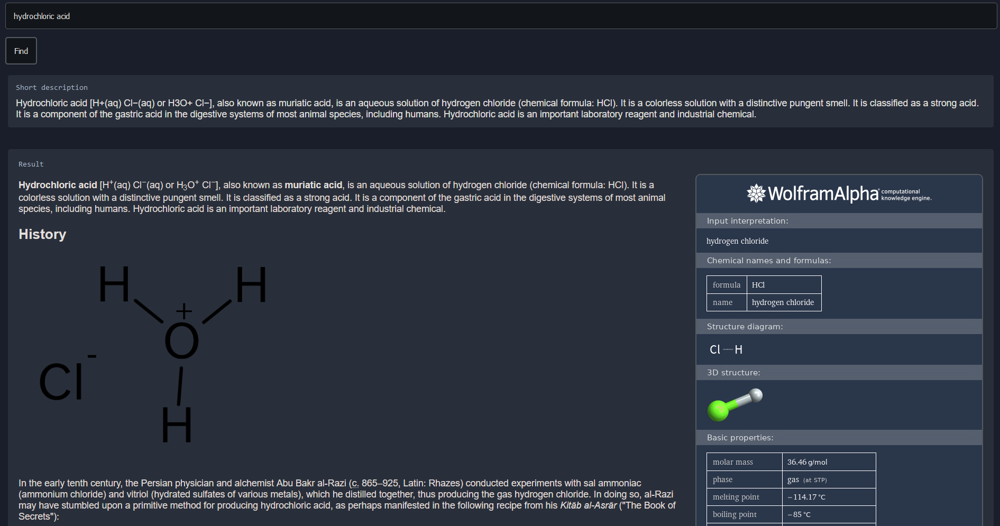

# [knowledgable](kachbit.github.io/knowledgable/)
Knowledge base for any topic with visuals, images, descriptions, videos.
kachbit.github.io/knowledgable/

**Instructions:**  
* input any topic, person, place, anything.
* results will include a short description, image result, and full results containing several paragraphs describing the inputted word. 
* to see video results, click on the "videos" container at there very bottom of the page.

**Q.**  How did I make this? 
**A.**  Lots of apis. Ps, please don't steal my api keys

Here is an example of the app in use using the query 'hydrochloric acid':

I made this in less that two days starting on 4/22/22 (fri)
