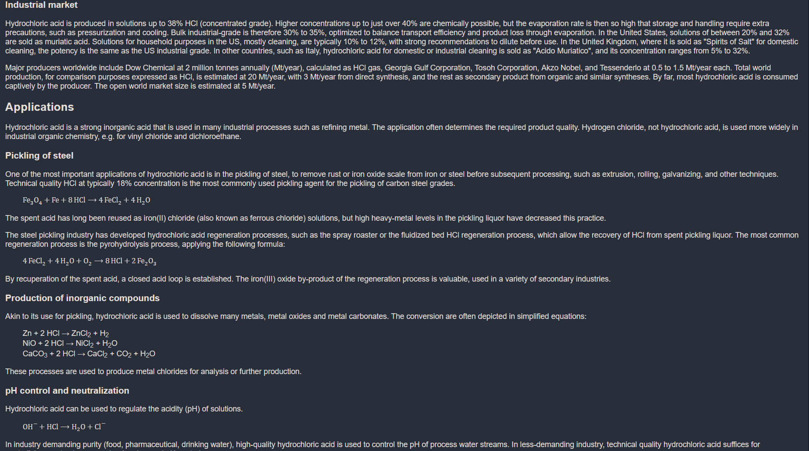

# [knowledgable](kachbit.github.io/knowledgable/)
Knowledge base for any topic with visuals, images, descriptions, videos.
kachbit.github.io/knowledgable/

**Instructions:**  
* input any topic, person, place, anything.
* results will include a short description, image result, and full results containing several paragraphs describing the inputted word. 
* to see video results, click on the "videos" container at there very bottom of the page.

How did I make this? The answer: Lots of apis. Ps, please don't steal my api keys. I wouldn't have had a problem with this if I had just used Node.js and hosted this webapp somewhere else, but in my mind, creating a full Node.js express server is way to much effort for a simple project like this. So I had to make it using the front end with vanilla javascript and it unfortunately makes my api keys public. Also, I HAtE CORS so I had to use stupid CORS proxys for all of my fetch requests which will probably eventually become outdated and break sometime in the future. And it also makes the content load slower. But, as of right now, my app is working so that's all that really matters. Sorry if my code is hard to read, I'm working on it.

Here is an example of the app in use using the query 'hydrochloric acid':

I made this in less that two days starting on 4/22/22 (fri)
